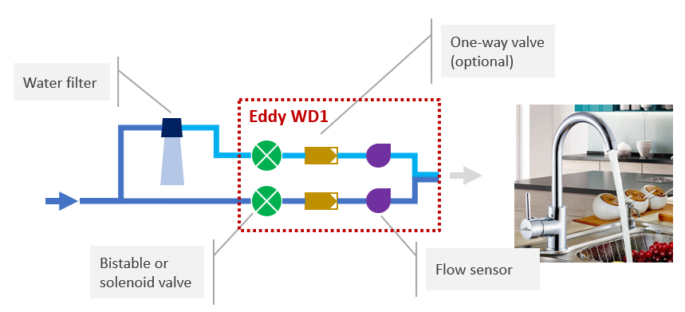

# Eddy WD1   
## Cheap DIY smart tap controller for purified water
Eddy WD1 is a cheap DIY smart tap controller for purified water based on [Mongoose OS](https://mongoose-os.com/). It can be easily integrated with your home automation system using MQTT protocol.
## Abstract

## GET STARTED
1. Connect your PC to the Eddy WD1 using an USB cable or WiFi
4. Set [mDash](https://mdash.net/) connection (optional)
5. Set MQTT connection
6. Connect Eddy WD1 to your WiFi
## Connect your PC to the Eddy WD1
Connect your PC to the Eddy WD1 to start the initial configuration or to update it. You can establish the connection in two ways:
